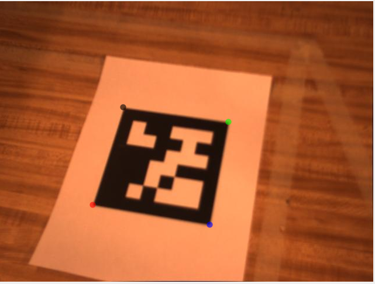
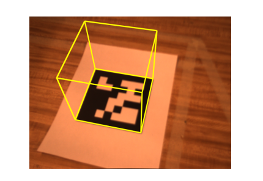

# AugmentedReality-using-Homography
Augmented reality using pose estimation and homography.

### objectives ###
* Use tracking and pose estimation to implement a simple augmented reality application.
* Use a KLT tracker to get the position of corners across different frames. 
* Use homography estimation to compute the 3D pose of a set of 4 points in the world and render a simple cube in the frame.

#### KLT Tracker ####

#### Result illustration ####

### How to use ###
* Clone the repository
* Extract the **AugmentedSurface** zip file in place ``data/apriltagims``.
* Run the **generate_ar_images.m** file.
* Visualize the result using ``play_video(generated-imgs)``.
* you can also visualize the KLT tracker by running **generate_klt_images.m** and then executing ``play_video(generated_imgs)``.
